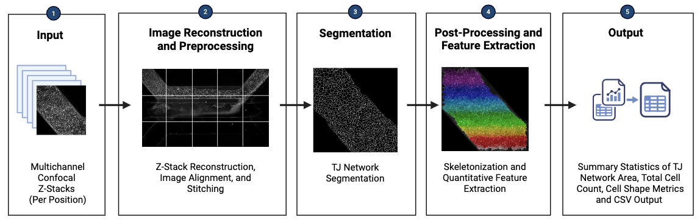

# Tight Junction Quantification Pipeline
### Cellpose-based pipeline for 3D Blood-Brain Barrier Confocal Images

[](https://drive.google.com/file/d/1AplvHG9f1uxdad4INGDMDY_skHbtLzMM/view?usp=sharing)

> **Paper:** *Modeling the Blood-Brain Barrier: A Three-Dimensional Multicellular Microfluidic Approach with Bioinformatics*

---

## Overview

This pipeline processes 3D confocal microscopy blood-brain barrier (BBB) images through four sequential stages: image organization in Fiji, tile stitching in Fiji, preprocessing in Fiji, and automated segmentation and quantification in Python.



---

## Table of Contents

- [Requirements](#requirements)
- [Installation](#installation)
- [Pipeline](#pipeline)
  - [Stage 1 — Image Organization](#stage-1--image-organization-fiji)
  - [Stage 2 — 3D Stitching](#stage-2--3d-stitching-fiji)
  - [Stage 3 — Preprocessing](#stage-3--preprocessing-fiji)
  - [Stage 4 — Segmentation & Quantification](#stage-4--segmentation--quantification-python--google-colab)
- [Expected Inputs](#expected-inputs)
- [Outputs](#outputs)
- [CSV Output](#csv-output-format)
- [Notes](#notes)

---

## Requirements

| Component | Version | Purpose |
|---|---|---|
| Python | ≥ 3.8 | Segmentation & quantification |
| Fiji (ImageJ) | Latest | Organization, stitching, preprocessing |
| CUDA (optional) | ≥ 11.3 | GPU acceleration for Cellpose |

**Python packages** (see `requirements.txt`):

```
cellpose >= 2.2.0
torch >= 1.13.0
scikit-image >= 0.19.0
numpy >= 1.23.0
pandas >= 1.5.0
matplotlib >= 3.5.0
```

---

## Installation

### Fiji

1. Download and install Fiji from [fiji.sc](https://fiji.sc)
2. The **Grid/Collection Stitching** plugin is bundled with Fiji — no additional installation required
3. Open macros in Fiji via `Plugins → Macros → Edit...` or drag-and-drop the `.ijm` file into the Fiji toolbar

### Python — Google Colab (Recommended)

No local installation needed. Click the Colab badge above, then:

1. Go to `File → Save a copy in Drive` to use your own Google account and GPU quota
2. Set runtime: `Runtime → Change runtime type → T4 GPU`
3. Run the **Installation and Imports** cell — all dependencies install automatically

### Python — Local

```bash
# 1. Clone the repository
git clone https://github.com/ib107/tj-network-quantification
cd scripts

# 2. Create and activate a virtual environment
python -m venv venv
source venv/bin/activate        # macOS/Linux
venv\Scripts\activate           # Windows

# 3. Install dependencies
pip install -r requirements.txt
```

For GPU support, install the CUDA-compatible PyTorch build **before** step 3. See [pytorch.org/get-started/locally](https://pytorch.org/get-started/locally/) and select your CUDA version.

---

## Pipeline

### Stage 1 — Image Organization (Fiji)

Run `folder_organize.ijm` on your raw experiment folder.

The macro parses filenames of the form:
```
E5_01_4_1Z0_Confocal CY5_001.tif
```

| Field | Example | Description |
|---|---|---|
| PlateID | `E5` | Experiment/plate identifier |
| Position | `01` | Tile position (zero-padded) |
| Series | `4` | Acquisition series number |
| ZInfo | `1Z0` | Z-slice index |
| Channel | `CY5` | Fluorescence channel (CY5, GFP, DAPI, TRITC) |
| Frame | `001` | Frame number |

Files not matching this pattern will be skipped and logged. The macro produces the following structure:

```
ExperimentFolder/
└── <Channel>/
    └── P<Position>/
        └── Z<Index>/
            └── *.tif
```

---

### Stage 2 — 3D Stitching (Fiji)

Run the appropriate stitching macro based on your position count:

| Macro | Positions | Grid |
|---|---|---|
| `stitch_p10.ijm` | 10 | 5 × 2 |
| `stitch_p15.ijm` | 15 | 5 × 3 |

Both macros:
1. Convert all position tiles to 8-bit stacks
2. Generate a coarse `TileConfiguration.txt` from estimated grid coordinates
3. Run Grid/Collection stitching with subpixel accuracy and automatic overlap refinement (Linear Blending fusion)
4. Save the stitched 3D `.tif`
5. Prompt an optional interactive dialog to trim artifact slices from the top or bottom of the stack

> **Before running:** update `rootDir` and `channel` at the top of whichever macro you use.

**Outputs:**
- `Stitched_<channel>_3D.tif` — full stitched z-stack
- `Stitched_<channel>_3D_trimmed.tif` — trimmed version (if selected)
- `TileConfiguration_refined_<channel>.txt` — registered tile coordinates

---

### Stage 3 — Preprocessing (Fiji)

Run `preprocess_stack.ijm` with your stitched image open in Fiji. It applies the following operations slice-by-slice across the full stack:

1. Rolling ball background subtraction (radius = 15)
2. Median filter (radius = 5)
3. Gaussian blur (σ = 2)
4. Contrast normalization (0.35% saturation)

The processed stack is saved as `<original_name>_preprocessed.tif` in the same directory.

---

### Stage 4 — Segmentation & Quantification (Python / Google Colab)

Open `TJ_Quantification.ipynb` in Google Colab with a T4 GPU runtime, or open `TJ_Quantification.py` locally. 

**Key parameters** (set in the Configuration cell at the top of the notebook):

```python
PIXEL_SCALE_UM        = 0.16   # microns per pixel (XY)
MIN_AREA_PX           = 100    # minimum object area (pixels)
BORDER_MARGIN_PX      = 50     # border exclusion margin (pixels)
Z_INDEX               = 0      # z-slice to use from 3D stack
NOISE_MAX_AREA_PX     = 300    # max area for noise removal
NOISE_MIN_CIRCULARITY = 0.80   # circularity threshold for noise removal
```

> **Important:** adjust `PIXEL_SCALE_UM` to match your microscope's XY pixel size before running.

Upload your preprocessed `.tif` when prompted. The notebook will:

1. Segment TJ regions using [Cellpose](https://github.com/MouseLand/cellpose) (auto diameter detection)
2. Apply size filter — removes objects below `MIN_AREA_PX`
3. Apply border filter — excludes objects within `BORDER_MARGIN_PX` of the image edge
4. Apply noise filter — removes small circular artifacts (`area < NOISE_MAX_AREA_PX` and `circularity > NOISE_MIN_CIRCULARITY`)
5. Display a 3-panel QC visualization showing each filter stage
6. Export a segmentation overlay image and measurements CSV

---

## Expected Inputs

| Stage | Input |
|---|---|
| Stage 1 | Raw `.tif` files with filenames matching `<PlateID>_<Position>_<Series>_<ZInfo>_Confocal <Channel>_<Frame>.tif` |
| Stage 2 | Organized folder structure produced by Stage 1 |
| Stage 3 | Stitched `.tif` stack from Stage 2, open in Fiji |
| Stage 4 | Single preprocessed grayscale `.tif` (2D or 3D); CY5 channel recommended for tight junction staining |

> For 3D inputs, the notebook extracts a single Z-slice defined by `Z_INDEX` (default: `0`). Do not pass multichannel or RGB images.

---

## Outputs

### Stitching (Stage 2)
- `Stitched_<channel>_3D.tif` — full stitched z-stack
- `Stitched_<channel>_3D_trimmed.tif` — trimmed version (if selected)
- `TileConfiguration_refined_<channel>.txt` — registered tile coordinates

### Preprocessing (Stage 3)
- `<original_name>_preprocessed.tif` — background-corrected, filtered stack

### Segmentation & Quantification (Stage 4)
- `<filename>_tj_pipeline_overview.tif` — 3-panel QC figure (raw → size/border filtered → noise filtered)
- `<filename>_tj_area_overlay.tif` — final segmentation overlay
- `<filename>_tj_measurements.csv` — per-object measurements and summary statistics

---

## CSV Output Format

**Summary Block** (First Section of CSV):

| Column | Description |
|---|---|
| `Total_Objects` | Total TJ regions detected after all filters |
| `Avg/Std_Area_Pixels` | Mean and SD of region area in pixels |
| `Avg/Std_Area_Microns2` | Mean and SD of region area in µm² |
| `Avg_Circularity` | Mean circularity (0–1; 1 = perfect circle) |
| `Avg_Eccentricity` | Mean eccentricity (0–1; 0 = circle) |
| `PIXEL_SCALE_UM` | Pixel scale used (µm/px) |
| Filter parameters | `MIN_AREA_PX`, `BORDER_MARGIN_PX`, `NOISE_MAX_AREA_PX`, `NOISE_MIN_CIRCULARITY` |

**Per-Object Block** (Second Section of CSV):

`Object_ID`, `Area_Pixels`, `Area_Microns2`, `Circularity`, `Eccentricity`, `Major_Axis_px`, `Minor_Axis_px`, `Centroid_Y`, `Centroid_X`

---

## Runtime Estimates

| Stage | Estimated Time | Notes |
|---|---|---|
| Image Organization | < 1 min | Depends on file count |
| Stitching (10 positions) | 5–10 min | Varies with tile size |
| Stitching (15 positions) | 5–15 min | Varies with tile size |
| Preprocessing | 1–5 min | Per stack in Fiji |
| Cellpose Segmentation (GPU) | 1–3 min | T4 GPU in Colab |
| Cellpose Segmentation (CPU) | 10–30 min | Significantly slower |
| Filtering + Measurement | < 1 min | — |

---

## Notes

- Pseudocoloring in segmentation overlays denotes distinct segmented TJ regions and does not encode a quantitative value
- The stitching script uses Linear Blending fusion with subpixel accuracy and automatic overlap computation
- Cellpose diameter is set to `None` by default (auto-detect); adjust `CELLPOSE_DIAMETER` if segmentation quality is poor on your images
- For large stitched stacks (> 5,000 × 5,000 px), consider cropping to a representative ROI before running the notebook, as Cellpose memory usage scales with image size
